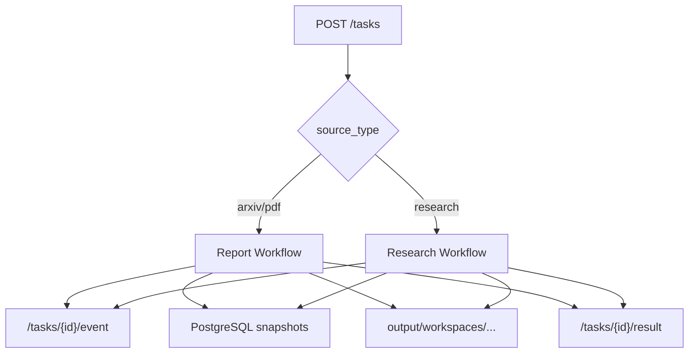

# PaperReader Agent — 项目概览

## 1. 项目到底是什么

PaperReader Agent 不是一个“检索几段上下文然后回答问题”的 Demo，而是一个面向科研报告生成的任务系统。它同时支持两种模式：

- 单篇论文模式：输入 arXiv ID、URL 或 PDF 文本，生成带引用验证的 Markdown 报告。
- Survey 模式：输入研究主题，自动完成澄清、检索、抽取、压缩、写作、review 与产物落盘。

从工程上看，它的主入口是统一的 `/tasks`，输出不是只返回一个字符串，而是同时维护：

- task 状态
- PostgreSQL snapshots
- `output/workspaces/` 下的中间工件
- SSE 实时事件流

## 2. 整体结构图



## 3. 用了什么方法（Use What）

### 3.1 入口模型

- 用 FastAPI 暴露统一任务入口。
- 用 `TaskRecord` 维护任务生命周期。
- 用后台协程运行长耗时工作流。

### 3.2 工作流模型

- 单论文走 report graph。
- 主题综述走 research graph。
- 两条图都由 LangGraph 编排，不用手写循环模拟。

### 3.3 结果模型

- PostgreSQL 存 durable snapshot 与 final report。
- workspace 文件夹存人类可读工件。
- SSE 负责把节点状态和文稿变化推给前端。

## 4. 当前项目怎么做（How To Do）

### 4.1 创建任务

任务创建时并不直接跑检索或生成，而是先把 task 建好、分配 workspace，然后把真正执行交给后台协程。

```python
@router.post("", response_model=CreateTaskResponse)
async def create_task(req: CreateTaskRequest) -> CreateTaskResponse:
    from src.agent.output_workspace import DEFAULT_WORKSPACE_USER, build_workspace_id

    source_type = req.source_type if req.source_type in {"arxiv", "pdf", "research"} else "arxiv"
    workspace_user = DEFAULT_WORKSPACE_USER or "user"
    workspace_id = (req.workspace_id or "").strip() or build_workspace_id(workspace_user)
    task = TaskRecord(
        input_type=req.input_type,
        input_value=req.input_value,
        report_mode=req.report_mode if req.report_mode in {"draft", "full"} else "draft",
        source_type=source_type,
        auto_fill=req.auto_fill,
        workspace_id=workspace_id,
    )
    _tasks[task.task_id] = task
    _sync_task_snapshot(task)

    asyncio.create_task(_run_graph(task.task_id))
```

代码位置：`src/api/routes/tasks.py`

### 4.2 后台路由到双工作流

`_run_graph()` 会根据 `source_type` 决定走 research supervisor 还是 report graph。

```python
if source_type == "research":
    from src.models.config import SupervisorMode
    from src.research.agents.supervisor import get_supervisor

    supervisor = get_supervisor()
    emitter = NodeEventEmitter()
    emitter.events = task.node_events
    initial_state: dict = {
        **_build_state_template(task.report_mode),
        "task_id": task.task_id,
        "workspace_id": task.workspace_id or "",
        "source_type": "research",
        "raw_input": task.input_value,
        "auto_fill": getattr(task, "auto_fill", False),
    }
else:
    from src.graph.builder import build_report_graph

    emitter = NodeEventEmitter()
    emitter.events = task.node_events
    graph = build_report_graph(emitter, use_checkpointer=True)
```

代码位置：`src/api/routes/tasks.py`

### 4.3 结果同时写数据库和 workspace

任务完成后，系统不会只更新内存状态，而是同步写入数据库和 workspace 目录。

```python
if task.result_markdown:
    report_id = save_task_report(
        task=task,
        report_kind="research_report" if source_type == "research" else "final_report",
        content_markdown=task.result_markdown,
        content_json={
            "brief": task.brief,
            "search_plan": task.search_plan,
            "rag_result": task.rag_result,
            "paper_cards": task.paper_cards,
            "compression_result": task.compression_result,
            "taxonomy": task.taxonomy,
            "draft_report": task.draft_report,
            "review_feedback": task.review_feedback,
            "review_passed": task.review_passed,
        },
    )

    from src.agent.output_workspace import write_report
    write_report(task.task_id, task.result_markdown, workspace_id=task.workspace_id)
```

代码位置：`src/api/routes/tasks.py`

## 5. 用户最后能看到什么

### API 层

- `POST /tasks`
- `GET /tasks/{id}`
- `GET /tasks/{id}/result`
- `GET /tasks/{id}/events`
- `POST /tasks/{id}/chat`

### 文件层

```text
output/workspaces/<workspace_id>/tasks/<task_id>/
├── metadata.json
├── brief.json
├── search_plan.json
├── rag_result.json
├── paper_cards.json
├── draft.md
├── review_feedback.json
├── report.md
└── revisions/
```

## 6. 这份项目概览在面试里怎么讲

建议按下面顺序说：

1. 先说它是科研报告生成系统，不是普通聊天机器人。
2. 再说它有双工作流，不同输入走不同图。
3. 再说它的主运行面是 `/tasks + SSE + workspace + PostgreSQL`。
4. 最后补一句：研究综述链路里还有 search、extract、compression、draft、review，不是一步生成。
