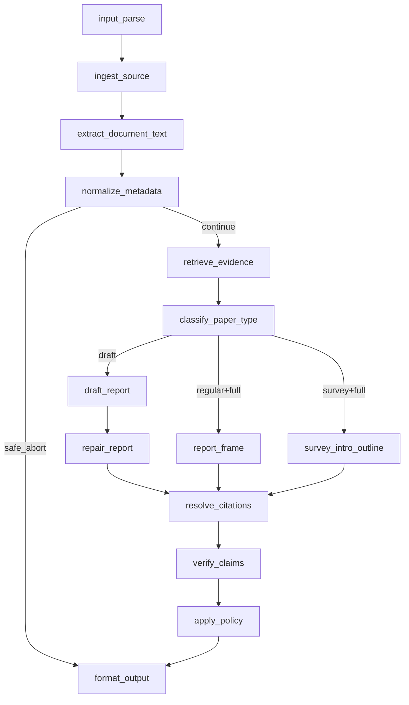
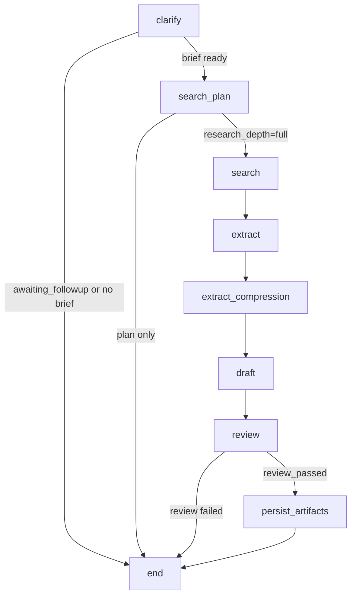

# PaperReader Agent — 工作流架构

## 1. 为什么是双工作流

这个项目不是“一条图处理所有输入”，而是明确拆成两条主路径：

- Report workflow：输入单篇论文或 PDF，输出单篇报告。
- Research workflow：输入研究主题，输出 survey / research report。

这样拆的原因很直接：

- 输入对象不同
- 节点职责不同
- 生成逻辑不同
- review 语义不同

## 2. 工作流图

### 2.1 Report workflow



### 2.2 Research workflow



## 3. 用了什么方法（Use What）

### 3.1 图编排

- 两条主图都用 `StateGraph`。
- 节点不是裸函数，而是通过 `instrument_node(...)` 包装，顺带产出节点事件。

### 3.2 条件路由

- report graph 用 `_should_abort`、`_select_generation_path`、`_has_draft`。
- research graph 用 `_route_after_clarify`、`_route_after_search_plan`、`_route_after_review`。

### 3.3 checkpoint

- 两条图都支持可选 checkpointer。
- 当前环境可以是 `MemorySaver` 或 `PostgresSaver`。

## 4. 当前项目怎么做（How To Do）

### 4.1 Report graph 的真实实现

```python
def build_report_graph(
    event_emitter: NodeEventEmitter | None = None,
    *,
    use_checkpointer: bool = False,
):
    g = StateGraph(AgentState)

    g.add_node("input_parse", instrument_node("input_parse", input_parse, event_emitter))
    g.add_node("ingest_source", instrument_node("ingest_source", ingest_source, event_emitter))
    g.add_node("extract_document_text", instrument_node("extract_document_text", extract_document_text, event_emitter))
    g.add_node("normalize_metadata", instrument_node("normalize_metadata", normalize_metadata, event_emitter))
    g.add_node("classify_paper_type", instrument_node("classify_paper_type", classify_paper_type, event_emitter))
    g.add_node("retrieve_evidence", instrument_node("retrieve_evidence", retrieve_evidence, event_emitter))
```

```python
g.add_conditional_edges(
    "classify_paper_type",
    _select_generation_path,
    {
        "draft_report": "draft_report",
        "report_frame": "report_frame",
        "survey_intro_outline": "survey_intro_outline",
    },
)

g.add_edge("resolve_citations", "verify_claims")
g.add_edge("verify_claims", "apply_policy")
g.add_edge("apply_policy", "format_output")
g.add_edge("format_output", END)
```

代码位置：`src/graph/builder.py`

### 4.2 Research graph 的真实实现

```python
def build_research_graph(
    event_emitter: NodeEventEmitter | None = None,
    *,
    use_checkpointer: bool = False,
):
    from src.graph.state import AgentState

    g = StateGraph(AgentState)

    g.add_node("clarify", instrument_node("clarify", run_clarify_node, event_emitter))
    g.add_node("search_plan", instrument_node("search_plan", run_search_plan_node, event_emitter))
    g.add_node("search", instrument_node("search", _with_current_stage("search", search_node), event_emitter))
    g.add_node("extract", instrument_node("extract", _with_current_stage("extract", extract_node), event_emitter))
    g.add_node("extract_compression", instrument_node("extract_compression", _with_current_stage("extract_compression", extract_compression_node), event_emitter))
    g.add_node("draft", instrument_node("draft", _with_current_stage("draft", draft_node), event_emitter))
    g.add_node("review", instrument_node("review", _with_current_stage("review", review_node), event_emitter))
```

```python
g.add_conditional_edges("clarify", _route_after_clarify, {
    "search_plan": "search_plan",
    END: END,
})

g.add_conditional_edges("search_plan", _route_after_search_plan, {
    "search": "search",
    END: END,
})

g.add_edge("search", "extract")
g.add_edge("extract", "extract_compression")
g.add_edge("extract_compression", "draft")
g.add_edge("draft", "review")
g.add_conditional_edges("review", _route_after_review, {
    "persist_artifacts": "persist_artifacts",
    END: END,
})
```

代码位置：`src/research/graph/builder.py`

### 4.3 任务层怎么分发到两条图

```python
if source_type == "research":
    from src.models.config import SupervisorMode
    from src.research.agents.supervisor import get_supervisor

    supervisor = get_supervisor()
    emitter = NodeEventEmitter()
    emitter.events = task.node_events
    initial_state: dict = {
        **_build_state_template(task.report_mode),
        "task_id": task.task_id,
        "workspace_id": task.workspace_id or "",
        "source_type": "research",
        "raw_input": task.input_value,
        "auto_fill": getattr(task, "auto_fill", False),
    }
else:
    from src.graph.builder import build_report_graph

    emitter = NodeEventEmitter()
    emitter.events = task.node_events
    graph = build_report_graph(emitter, use_checkpointer=True)
```

代码位置：`src/api/routes/tasks.py`

## 5. 当前工作流里几个最关键的设计点

### 5.1 clarify 可以早停

- 输入不清楚时，research workflow 不会盲目进入 search。
- 这能减少离题论文和后续写作污染。

### 5.2 search_plan 支持 plan-only

- 不是每次都必须跑完整检索。
- 可以先停在规划阶段用于调试、展示或交互澄清。

### 5.3 review 是真正的 gate

- `review_passed=False` 时不会进入 `persist_artifacts`。
- 这意味着“有 draft”不等于“正式通过”。

### 5.4 图是线性的，但节点内并发很强

- research graph 本身并不是复杂 fan-out DAG。
- 主要并发藏在 `search` 和 `extract` 节点内部。

## 6. 面试里怎么讲“工作流架构”

推荐口径：

1. 先说这是双图架构，而不是单图。
2. 再说 research graph 是 8 节点显式流程。
3. 再说 report graph 更偏单篇报告生产链。
4. 最后补一句：真正的并发主要发生在节点内部，不是拓扑级 fan-out/fan-in。
