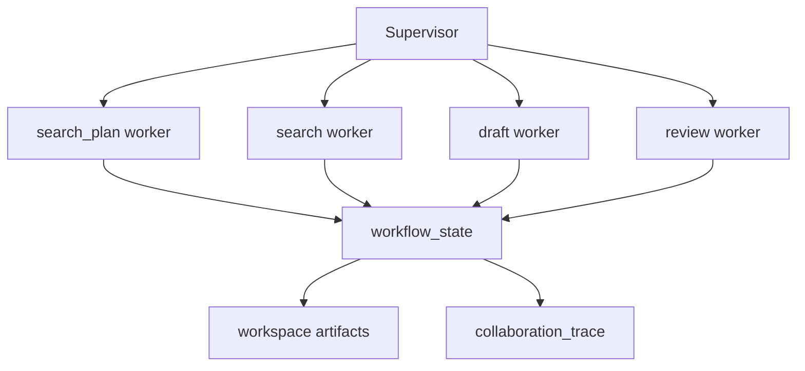

# PaperReader Agent — 多智能体协作

## 1. 当前应该怎么定义“多智能体”

对这个项目最准确的表述不是“开放式 agent society”，而是：

> 一个由官方 LangGraph supervisor 驱动的 staged multi-agent workflow。

意思是：

- 有明确阶段顺序
- 每个阶段可以由不同 worker 负责
- supervisor 负责编排 handoff 和阶段推进
- 但整体仍然围绕固定 research workflow 运转

## 2. 协作结构图



## 3. 用了什么方法（Use What）

### 3.1 官方 supervisor API

- `create_supervisor(...)`
- `create_react_agent(...)`

### 3.2 阶段式 worker

- `search_plan`
- `search`
- `draft`
- `review`

### 3.3 兼容层

- 仍保留 `AgentSupervisor` facade。
- 支持 legacy node backend 与 v2 agent backend 共存。
- 节点结果会主动同步到 workspace。

## 4. 当前项目怎么做（How To Do）

### 4.1 worker agent 如何构建

每个阶段 worker 都被包成官方 `create_react_agent`，并且强制只调用自己的单一 stage tool。

```python
def _build_node_agent(
    self,
    node_name: str,
    workflow_state: dict[str, Any],
    collaboration_trace: list[dict[str, Any]],
    executed_nodes: list[str],
    inputs: dict | None,
):
    stage_tool = self._build_node_tool(node_name, workflow_state, collaboration_trace, executed_nodes, inputs)
    return create_react_agent(
        model=_BoundToolCallingModel(final_response=f"__completed_stage__:{node_name}"),
        tools=[stage_tool],
        name=node_name,
        prompt=(
            f"You own only the {node_name} stage of the research workflow. "
            "Always call your single tool exactly once, then stop."
        ),
    )
```

代码位置：`src/research/agents/supervisor.py`

### 4.2 supervisor graph 如何构建

```python
workflow = create_supervisor(
    worker_agents,
    model=supervisor_model,
    prompt=(
        "You supervise the research workflow. Hand off only to the next allowed "
        "stage, wait for the stage to finish, and stop when all allowed stages are done."
    ),
    output_mode="last_message",
    parallel_tool_calls=False,
)
return workflow.compile(checkpointer=get_langgraph_checkpointer("agent_supervisor"))
```

代码位置：`src/research/agents/supervisor.py`

### 4.3 对外仍保留 `AgentSupervisor` facade

```python
class AgentSupervisor:
    """Research multi-agent supervisor backed by the official supervisor API."""

    def __init__(self, config: Phase4Config | None = None):
        self.config = config or Phase4Config()
        self._node_backends: dict[str, NodeBackend] = {}
```

这个 facade 现在主要负责：

- 暴露稳定接口给 API 层
- 节点 backend 选择
- workspace 同步
- collaboration trace 记录

### 4.4 实际协作是如何触发的

```python
graph = self.build_official_supervisor_graph(
    node_names=planned_nodes,
    workflow_state=workflow_state,
    collaboration_trace=collaboration_trace,
    executed_nodes=executed_nodes,
    inputs=inputs,
)
await graph.ainvoke(
    {
        "messages": [
            HumanMessage(
                content=self._build_collaboration_request(
                    workflow_state,
                    node_names=planned_nodes,
                )
            )
        ]
    },
    config=build_graph_config(
        "agent_supervisor",
        recursion_limit=max(len(planned_nodes) * 6 + 12, 24),
    ),
)
```

代码位置：`src/research/agents/supervisor.py`

## 5. backend 切换是怎么回事

当前 supervisor 并不是只支持一种执行实现，它还维护了迁移期的 backend 切换能力。

```python
LEGACY_NODE_TARGETS: dict[str, tuple[str, str]] = {
    "clarify": ("src.research.graph.nodes.clarify", "run_clarify_node"),
    "search_plan": ("src.research.graph.nodes.search_plan", "run_search_plan_node"),
    "search": ("src.research.graph.nodes.search", "search_node"),
    "extract": ("src.research.graph.nodes.extract", "extract_node"),
    "extract_compression": ("src.research.graph.nodes.extract_compression", "extract_compression_node"),
    "draft": ("src.research.graph.nodes.draft", "draft_node"),
    "review": ("src.research.graph.nodes.review", "review_node"),
    "persist_artifacts": ("src.research.graph.nodes.persist_artifacts", "persist_artifacts_node"),
}
```

```python
V2_AGENT_TARGETS: dict[str, dict[str, str]] = {
    "search_plan": {
        "module": "src.research.agents.planner_agent",
        "fn": "run_planner_agent",
        "paradigm": AgentParadigm.PLAN_AND_EXECUTE.value,
    },
    "search": {
        "module": "src.research.agents.retriever_agent",
        "fn": "run_retriever_agent",
        "paradigm": AgentParadigm.TAG.value,
    },
}
```

代码位置：`src/research/agents/supervisor.py`

这意味着当前系统可以：

- 保持旧节点仍能运行
- 逐个阶段切换到新 agent backend
- 在不重写整条链的情况下灰度迁移

## 6. 为什么当前多 agent 设计是合理的

### 优点

- 比一个超级 prompt 更容易调试和观测
- 阶段职责清晰
- 便于局部替换 planner/retriever/analyst/reviewer
- 更适合把不同阶段落盘成 artifacts

### 当前边界

- 还不是完全自由自治协作
- 仍然围绕 canonical node order
- facade 和兼容层还在，说明迁移没有彻底结束

## 7. 面试里怎么回答“你们多智能体怎么做的”

推荐回答：

1. 用官方 `create_supervisor + create_react_agent` 做编排。
2. 每个 worker 对应 research workflow 的一个阶段，不是任意游走。
3. supervisor 外面保留了一个工程 facade，负责 backend 切换、workspace 同步和 trace。
4. 所以它是工程化 staged multi-agent，而不是纯演示式的 agent 自由对话。
