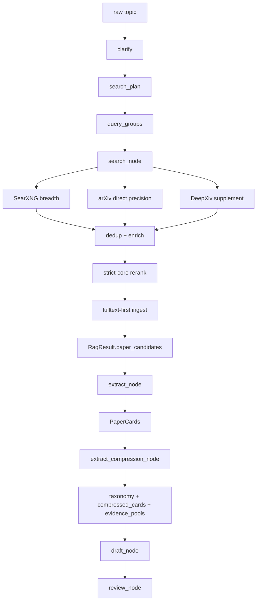

# PaperReader Agent — RAG 检索架构详解

> 本文是 `tech_part` 里最重要的一篇。  
> 这套系统的 RAG 不是“搜一下然后回答”，而是“规划检索 -> 多源召回 -> 严格筛选 -> 正文优先 ingest -> 结构化抽取 -> 上下文压缩 -> 写作与验证”。

## 1. RAG 主链全图



## 2. 这套 RAG 和普通 QA-RAG 的区别

| 维度 | 普通 QA-RAG | 本项目 |
|---|---|---|
| 查询输入 | 用户问题 | 研究主题 + sub-questions + search plan |
| 检索对象 | chunks | paper candidates + fulltext snippets + paper cards |
| 检索后处理 | rerank 后直接拼上下文 | dedup / enrich / strict-core rerank / ingest / extract |
| 中间表示 | evidence chunks | RagResult + PaperCards + CompressionResult |
| 最终目标 | 回答问题 | 写 survey / research report |
| 质量闭环 | 通常较弱 | review + grounding + claim verification |

## 3. 用了什么方法（Use What）

### 3.1 查询规划

- `clarify` 把原始主题转成 `ResearchBrief`
- `search_plan` 产出 `query_groups`、`plan_goal`、`time_range`
- 低置信度或 follow-up 情况下可回退 heuristic plan

### 3.2 多源并行召回

- SearXNG：广度召回
- arXiv direct：精度和 metadata
- DeepXiv：TLDR / 趋势 / 补充发现

### 3.3 质量控制

- arXiv ID + URL dedup
- arXiv enrich
- strict-core rerank
- 默认年份过滤

### 3.4 正文优先证据

- 不是只拿 abstract
- 先下载全文、切 chunk、写入本地语料层
- 失败后才退到 abstract-only

### 3.5 Progressive Reading

- DeepXiv brief
- LLM 批量抽取
- fallback simple card

### 3.6 写作前压缩

- taxonomy
- compressed cards
- section evidence pools

## 4. 当前项目怎么做（How To Do）

### 4.1 Clarify：先把问题澄清成 brief

如果 research 输入模糊，系统不会立刻去搜，而是先做澄清与 follow-up 判断。

```python
if result.brief.needs_followup:
    if auto_fill:
        warnings.append(
            f"ClarifyAgent still returned needs_followup=True in auto_fill mode "
            f"(confidence={result.brief.confidence:.2f})."
        )
    elif interaction_mode == "interactive":
        awaiting_followup = True
        warnings.append(
            f"ClarifyAgent flagged needs_followup=True (confidence={result.brief.confidence:.2f}). "
            "Workflow paused for user follow-up."
        )
```

代码位置：`src/research/graph/nodes/clarify.py`

### 4.2 SearchPlan：生成查询组

低置信度时不会硬上复杂 planner，而是允许 heuristic fallback。

```python
needs_followup = brief.get("needs_followup", False)
confidence = brief.get("confidence", 1.0)
use_heuristic = state.get("use_heuristic", False) or needs_followup or confidence < 0.5

if use_heuristic:
    from src.research.policies.search_plan_policy import to_fallback_plan

    plan = to_fallback_plan(brief)
    warnings = ["SearchPlanAgent fast path used heuristic fallback plan"]
```

代码位置：`src/research/graph/nodes/search_plan.py`

### 4.3 Search：三源并行召回

```python
with ThreadPoolExecutor(max_workers=3) as pool:
    searxng_future = pool.submit(_run_searxng_queries, all_queries)
    arxiv_future = pool.submit(_run_arxiv_direct_search, all_queries, effective_year_filter)
    deepxiv_future = pool.submit(_run_deepxiv_queries, all_queries, effective_year_filter)

searxng_results, query_traces = searxng_future.result()
arxiv_direct_results = arxiv_future.result()
deepxiv_results = deepxiv_future.result()
```

代码位置：`src/research/graph/nodes/search.py`

这里不是简单“哪个源能搜到就用哪个”，而是明确分工：

- SearXNG 负责广覆盖
- arXiv direct 负责高质量 metadata
- DeepXiv 负责补充性发现

### 4.4 Dedup 与 enrich

```python
for paper in arxiv_direct_results:
    aid = paper.get("arxiv_id") or ""
    url = paper.get("url", "")
    if aid and aid in seen_arxiv_ids:
        continue
    if url and url in seen_urls:
        continue
    if aid:
        seen_arxiv_ids.add(aid)
    if url:
        seen_urls.add(url)
    combined.append(paper)

enriched = enrich_search_results_with_arxiv(combined)
```

代码位置：`src/research/graph/nodes/search.py`

优先级是：

- arXiv API
- DeepXiv
- SearXNG

原因是 metadata 完整性从高到低排列。

### 4.5 Strict-core rerank

系统不是只要召回更多就完事，它还会做严格主题筛选。

```python
STRICT_CORE_GROUPS = {"agent", "medical", "multimodal_or_imaging", "diagnosis_or_triage"}
STRICT_CORE_FATAL_PENALTIES = {
    "outside_requested_time_range",
    "governance_without_clinical_scope",
    "off_topic_core_intent",
    "component_method_without_agent_scope",
    "missing_agent_for_strict_scope",
}
```

```python
final_candidates, rerank_log = _rerank_and_filter_candidates(
    final_candidates,
    brief=brief or {},
    search_plan=search_plan or {},
)
```

代码位置：`src/research/graph/nodes/search.py`

这一步的目标是：

- 减少 off-topic
- 减少无 agentic scope 的候选
- 保住后续 draft 的主题纯度

### 4.6 Fulltext-first ingest

search 结束后，不是直接把结果扔给 draft，而是先把候选论文写进本地证据层。

```python
ingest_stats = _ingest_paper_candidates(
    final_candidates,
    workspace_id=state.get("workspace_id"),
)

fulltext_attempted = int(ingest_stats.get("fulltext_attempted", 0))
fulltext_success = int(ingest_stats.get("fulltext_success", 0))
fulltext_ratio = (
    (fulltext_success / fulltext_attempted) if fulltext_attempted > 0 else 0.0
)
```

代码位置：`src/research/graph/nodes/search.py`

这个比率很关键，因为它直接决定系统是在“读正文写综述”，还是“只看摘要硬写”。

### 4.7 Extract：预算驱动选择，不固定前 N 篇

```python
MAX_EXTRACT_CANDIDATES_HARD = 42
MAX_EXTRACT_EVIDENCE_CHARS = 60000
TARGET_FULLTEXT_RATIO = 0.70

candidates = _select_candidates_for_extract(
    candidates,
    max_candidates_hard=MAX_EXTRACT_CANDIDATES_HARD,
    evidence_char_budget=MAX_EXTRACT_EVIDENCE_CHARS,
    min_fulltext_ratio=TARGET_FULLTEXT_RATIO,
)
```

代码位置：`src/research/graph/nodes/extract.py`

这里的设计点是：

- 不再固定截断前 20 或前 30
- 优先保留有全文证据的候选
- 同时控制总 evidence budget

### 4.8 Extract：Progressive Reading

```python
"""
Progressive Reading 策略（参考 DeepXiv）：
1. DeepXiv brief（优先）
2. LLM 抽取（次级）
3. Fallback（兜底）
"""

if arxiv_ids_for_brief:
    from src.tools.deepxiv_client import batch_get_briefs
    brief_map = batch_get_briefs(arxiv_ids_for_brief, max_workers=4, delay_per_request=0.3)
```

代码位置：`src/research/graph/nodes/extract.py`

### 4.9 Extract：正文优先而不是摘要优先

```python
fulltext_snippets = _extract_fulltext_snippets(cand)
fulltext_evidence = _snippets_to_text(
    fulltext_snippets,
    max_items=4,
    max_chars=2800,
)

display_abstract = abstract
evidence_source = "abstract"
if fulltext_evidence:
    display_abstract = fulltext_evidence
    evidence_source = "fulltext_chunks"
elif deepxiv_brief:
    tldr = deepxiv_brief.get("tldr", "") or deepxiv_brief.get("abstract", "")
    if tldr:
        display_abstract = tldr
        evidence_source = "deepxiv_tldr"
```

代码位置：`src/research/graph/nodes/extract.py`

### 4.10 Compression：把 paper cards 变成可写作结构

```python
result = compress_paper_cards(paper_cards, brief)

return {
    "compression_result": result.model_dump(),
    "taxonomy": result.taxonomy.model_dump(),
}
```

代码位置：`src/research/graph/nodes/extract_compression.py`

压缩服务本身做三件事：

```python
# Step 1: 构建 Taxonomy
taxonomy = _build_taxonomy(cards_to_process, brief)

# Step 2: 压缩论文摘要
compressed = _build_compressed_abstracts(cards_to_process, taxonomy)

# Step 3: 构建 Per-Section Evidence Pool
pools = _build_evidence_pools(compressed, taxonomy, brief)
```

代码位置：`src/research/services/compression.py`

### 4.11 Draft：消费压缩结构而不是直接塞原始卡片

```python
compression_result = state.get("compression_result")

if compression_result:
    draft_report = _build_draft_with_compression(
        paper_cards, brief, compression_result, skill_artifacts=skill_artifacts
    )
else:
    draft_report = _build_draft_report(paper_cards, brief, skill_artifacts=skill_artifacts)
```

代码位置：`src/research/graph/nodes/draft.py`

## 5. 这套 RAG 最关键的指标应该怎么看

### 5.1 paper_count

- 看召回规模
- 但不能单独看

### 5.2 fulltext_ratio

- 看系统到底有多少正文证据
- 这是比 paper_count 更接近成文质量的指标

### 5.3 off_topic_ratio

- 看 strict-core rerank 是否把主题守住了

### 5.4 claim grounding / report confidence

- 看最终写出来的内容是否真的被证据支撑

## 6. 为什么说当前 RAG 设计是“写作型 RAG”

因为它的输出目标不是一句回答，而是：

- paper card 结构化表示
- taxonomy
- section evidence pools
- draft report
- verified report

这意味着它更像“研究写作生产线”，不是“问题回答器”。

## 7. 面试时怎么讲这套 RAG

推荐回答顺序：

1. 输入 topic 后先 clarify 和 search planning。
2. search 阶段做三源并行召回。
3. 然后 dedup、arXiv enrich、strict-core rerank。
4. 再做 fulltext-first ingest，把证据写入本地层。
5. extract 阶段用 Progressive Reading 构造 paper cards。
6. compression 阶段把卡片压成 taxonomy 和 evidence pools。
7. 最后 draft / review 用这些结构化证据写 survey，并做 grounding。
