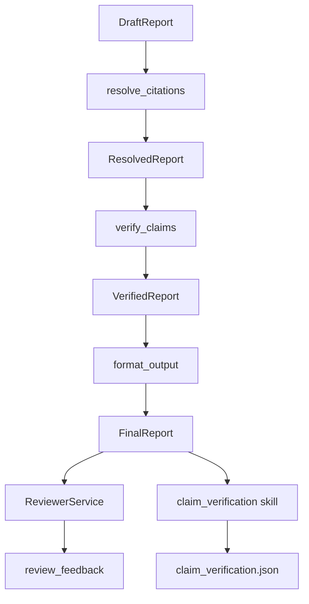

# PaperReader Agent — Grounding 与引用验证体系

## 1. 这套验证系统在项目里的位置

RAG 找到论文、draft 写出报告之后，系统不会直接把文稿当成可信结果交付。当前主链还会继续经过：

1. `resolve_citations`
2. `verify_claims`
3. `format_output`
4. `ReviewerService`
5. `claim_verification` skill

也就是说，这个项目的“可信输出”不是口头要求，而是真实代码链路。

## 2. Grounding 工作流图



## 3. 用了什么方法（Use What）

### 3.1 三段式 grounding pipeline

- citation resolve
- claim verification
- final output formatting

### 3.2 规则化 reviewer gate

- 覆盖性
- claim 支撑情况
- citation 可达性
- citation breadth / concentration
- 结构重复和一致性

### 3.3 skill 化 claim 验证

- 把 claim grounding 进一步结构化成可统计 artifact

## 4. 当前项目怎么做（How To Do）

### 4.1 先跑 `ground_draft_report()`

```python
def ground_draft_report(
    draft_report: DraftReport | None,
    paper_cards: list[Any] | None = None,
    *,
    report_mode: str = "draft",
    degradation_mode: str = "normal",
) -> dict[str, Any]:
    if draft_report is None:
        return {}

    state: dict[str, Any] = {
        "draft_report": draft_report,
        "paper_cards": paper_cards or [],
        "report_mode": report_mode,
        "degradation_mode": degradation_mode,
        "warnings": [],
        "errors": [],
    }

    for node in (resolve_citations, verify_claims, format_output):
        patch = node(state)
        if isinstance(patch, dict):
            state.update(patch)
```

代码位置：`src/research/services/grounding.py`

### 4.2 `review_node` 先 grounding，再 reviewer，再 skill

```python
if draft_report is not None:
    grounding_result = ground_draft_report(
        draft_report,
        paper_cards=paper_cards,
        report_mode=str(state.get("report_mode", "draft") or "draft"),
        degradation_mode=str(state.get("degradation_mode", "normal") or "normal"),
    )

feedback = _run_reviewer_sync(
    task_id=task_id,
    workspace_id=workspace_id,
    rag_result=rag_result,
    paper_cards=paper_cards,
    report_draft=report_draft,
)
```

```python
if grounded_report_for_skill is not None and workspace_id and task_id:
    claim_verification, skill_entries = _run_claim_verification_skill(
        workspace_id=workspace_id,
        task_id=task_id,
        draft_report=grounded_report_for_skill,
    )
```

代码位置：`src/research/graph/nodes/review.py`

### 4.3 `verify_claims` 如何判 grounded / partial / ungrounded

```python
for claim in resolved.claims:
    supports = []
    for label in claim.citation_labels:
        cit = cit_map.get(label)
        if not cit:
            warnings.append(
                f"verify_claims: claim {claim.id} references unknown citation {label}"
            )
            continue

        support = judge_claim_citation(
            claim_id=claim.id,
            claim_text=claim.text,
            citation_label=label,
            citation_content=cit.fetched_content,
            llm=llm,
        )
        supports.append(support)
```

```python
if not supports:
    overall = "abstained"
else:
    statuses = [s.support_status for s in supports]
    if any(s == "supported" for s in statuses):
        overall = "grounded"
    elif any(s == "partial" for s in statuses):
        overall = "partial"
    elif all(s == "unverifiable" for s in statuses):
        overall = "abstained"
    else:
        overall = "ungrounded"
```

代码位置：`src/graph/nodes/verify_claims.py`

### 4.4 `format_output` 如何算 `report_confidence`

```python
if grounding.total_claims > 0:
    grounded_ratio = grounding.grounded / grounding.total_claims
    partial_ratio = grounding.partial / grounding.total_claims
    ungrounded_ratio = grounding.ungrounded / grounding.total_claims
    if grounded_ratio >= 0.8 and partial_ratio <= 0.2 and ungrounded_ratio == 0.0:
        grounding_confidence = "high"
    elif grounded_ratio >= 0.5 and ungrounded_ratio <= 0.2:
        grounding_confidence = "limited"
    else:
        grounding_confidence = "low"
```

```python
final = FinalReport(
    sections=dict(source.sections),
    claims=list(source.claims),
    citations=list(source.citations),
    grounding_stats=grounding,
    report_confidence=confidence,
)
```

代码位置：`src/graph/nodes/format_output.py`

## 5. ReviewerService 在挡什么

`ReviewerService` 不是简单打一段评语，而是真在做质量门。

```python
cards_issues, cards_actions = self._check_paper_cards_quality(paper_cards)
coverage_issues, coverage_gap_items, coverage_actions = self._check_coverage(
    rag_result, paper_cards, report_draft
)
claim_issues, claim_supports, claim_actions = self._check_claim_support(
    rag_result, paper_cards, report_draft
)
citation_issues, citation_actions = self._check_citation_reachability(
    rag_result, report_draft
)
citation_balance_issues, citation_balance_actions = self._check_citation_breadth_and_balance(
    paper_cards, report_draft
)
dup_issues, dup_actions = self._check_duplication_consistency(report_draft)
```

代码位置：`src/research/services/reviewer.py`

### 重点一：paper card 质量检查

```python
if bad_ratio > 0.3:
    issue = ReviewIssue(
        severity=ReviewSeverity.BLOCKER,
        category=ReviewCategory.COVERAGE_GAP,
        target="paper_cards",
        summary=(
            f"{bad_count}/{total} paper cards have invalid titles "
            f"({bad_ratio:.0%}). Likely search metadata extraction failed. "
        ),
    )
```

### 重点二：unsupported claims 会真的影响是否通过

```python
if overall_status == "ungrounded":
    unsupported_claim_ids.append(claim_id)
elif overall_status == "partial":
    partial_claim_ids.append(claim_id)
elif overall_status == "abstained":
    abstained_claim_ids.append(claim_id)
```

## 6. 这套体系解决了什么问题

### 6.1 防止“写得像，但没证据”

- claim 可以被单独检查
- citation 不是只看格式，还看 reachability 和 content

### 6.2 防止“只会引用两篇论文”

- reviewer 会关心 citation breadth / concentration
- draft 后处理也会做 citation redistribution

### 6.3 防止“检索好但成文差”

- 高 `rag_score` 不代表 report 一定能过
- review gate 会把最终成文质量单独拎出来判断

## 7. 面试里怎么讲

推荐口径：

1. 我们不是只做 RAG，还做 grounding pipeline。
2. pipeline 是 `resolve_citations -> verify_claims -> format_output`。
3. review 阶段还有 `ReviewerService + claim_verification skill`。
4. 最终 `report_confidence` 由 grounded/partial/ungrounded 画像和 degradation mode 共同决定。
