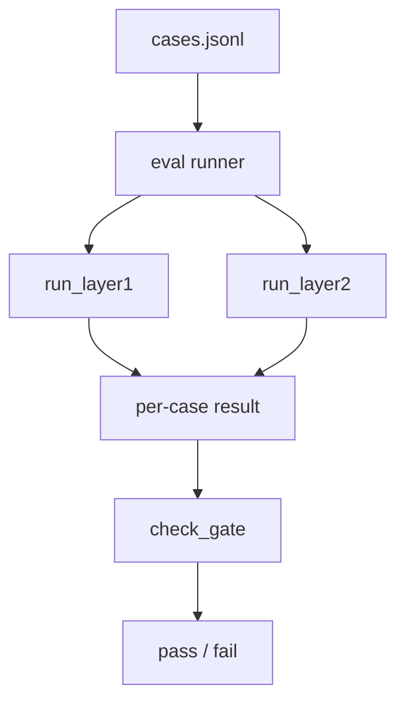

# PaperReader Agent — 评测体系与量化指标

## 1. 当前评测系统是什么

这个项目现在已经有一个代码化的评测目录 `eval/`，不是只靠人工肉眼看报告。它主要由三层组成：

1. Layer 1：hard rules
2. Layer 2：grounding checks
3. Gate：把 pass rate、regression、预算约束汇总成发布门

## 2. 评测结构图



## 3. 用了什么方法（Use What）

### 3.1 L1：硬规则

- markdown 结构检查
- citation section / citation count
- must_include 关键词
- token cost guard

### 3.2 L2：grounding 规则

- claim support rate
- citation resolution rate
- unsupported claim count
- abstention compliance
- source tier ratio

### 3.3 Gate：运行级门控

- L1 pass rate
- L2 pass rate
- regression count
- token budget

## 4. 当前项目怎么做（How To Do）

### 4.1 Eval runner 会直接跑任务生命周期

```python
def run_research_via_api(topic: str) -> tuple[str, str]:
    import requests

    base_url = os.getenv("PAPERREADER_API_URL", "http://localhost:8000")
    payload = {
        "input_type": "arxiv",
        "input_value": topic,
        "report_mode": "draft",
        "source_type": "research",
    }
    resp = requests.post(f"{base_url}/tasks", json=payload, timeout=10)
```

```python
for _ in range(120):
    time.sleep(5)
    result_resp = requests.get(f"{base_url}/tasks/{task_id}", timeout=10)
    result = result_resp.json()
    status = result.get("status", "unknown")
    if status in ("completed", "failed"):
        ...
```

代码位置：`eval/runner.py`

这意味着评测不是只测某个纯函数，而是真正测任务 API 与报告输出。

### 4.2 Layer 1：hard rules

```python
def run_layer1(report_md: str, case: dict, tokens_used: int = 0) -> dict:
    checks: dict[str, dict] = {}

    checks["structure"] = check_structure(report_md, case.get("sections"))

    min_citations = case.get("min_citations", 1)
    checks["citation_format"] = check_citation_format(report_md, required=(min_citations > 0))

    if "must_include" in case:
        checks["must_include"] = check_must_include(report_md, case["must_include"])

    if "min_citations" in case:
        checks["min_citations"] = check_min_citations(report_md, case["min_citations"])

    checks["cost_guard"] = check_cost_guard(tokens_used)
```

代码位置：`eval/layers/hard_rules.py`

### 4.3 Layer 1：结构和引用检查示例

```python
def check_structure(report_md: str, required_sections: set[str] | None = None) -> dict:
    found = _extract_headings(report_md)
    ...

def check_citation_format(report_md: str, required: bool = True) -> dict:
    has_section = bool(
        re.search(r"^##\s+引用", report_md, re.MULTILINE)
        or re.search(r"^##\s+参考文献", report_md, re.MULTILINE)
        or re.search(r"^##\s+References", report_md, re.MULTILINE)
    )
```

代码位置：`eval/layers/hard_rules.py`

### 4.4 Layer 2：grounding 检查

```python
def check_claim_support_rate(final: FinalReport, threshold: float = 0.6) -> dict:
    stats = final.grounding_stats
    total = stats.total_claims
    if total == 0:
        return {"pass": True, "rate": 1.0, "threshold": threshold, "detail": "no claims"}

    supported = stats.grounded + stats.partial
    rate = supported / total
    return {"pass": rate >= threshold, "rate": round(rate, 3), "threshold": threshold}
```

```python
def run_layer2(final: FinalReport, case: dict | None = None) -> dict:
    checks = {}
    checks["claim_support_rate"] = check_claim_support_rate(final)
    checks["citation_resolution"] = check_citation_resolution_rate(final)
    checks["unsupported_count"] = check_unsupported_claim_count(final)
    checks["abstention_compliance"] = check_abstention_compliance(final)
    checks["source_tier_ratio"] = check_source_tier_ratio(final)
```

代码位置：`eval/layers/grounding.py`

### 4.5 Gate：运行级门控

```python
DEFAULT_THRESHOLDS = {
    "l1_pass_rate": 0.9,
    "l2_pass_rate": 0.7,
    "max_regressions": 0,
    "max_cost_tokens": 50000,
}

def check_gate(
    run_result: dict,
    thresholds: dict | None = None,
    diff: dict | None = None,
) -> dict:
    ...
    l1_passed = sum(1 for r in results if r.get("layer1", {}).get("pass", False))
    l1_rate = l1_passed / total
```

代码位置：`eval/gate.py`

## 5. 当前项目里最有解释力的指标

### 5.1 结构类

- section 是否齐
- citation section 是否存在
- 是否满足最小引用数

### 5.2 grounding 类

- claim_support_rate
- citation_resolution_rate
- unsupported_count
- source_tier_ratio

### 5.3 运行结果类

- pass rate
- regressions
- tokens budget
- duration

## 6. 这套评测现在的边界

- 当前 `eval/` 更偏规则化自动评估，不是完整的人类主观写作评分系统。
- runner 已经能跑真实任务 API，但长耗时 case 仍可能受外部环境影响。
- 如果模型或网关环境异常，评测前必须先做环境探活。

## 7. 和环境检查怎么衔接

仓库硬规则已经要求：

- 跑 full-flow / e2e 前先执行 `python tests/api/check_env_gpt_models.py`

这一步的意义是把：

- 模型不可用
- 网关异常
- 真实工作流回归

三类问题分开。

## 8. 面试里怎么讲

推荐回答：

1. 我们有 `eval/` 目录，不是只靠人工看结果。
2. 第一层是 hard rules，第二层是 grounding checks。
3. 运行结束后还有 gate，根据 pass rate、regression 和预算判断是否通过。
4. 因为这是长任务系统，所以评测前还会先做模型连通性检查。
