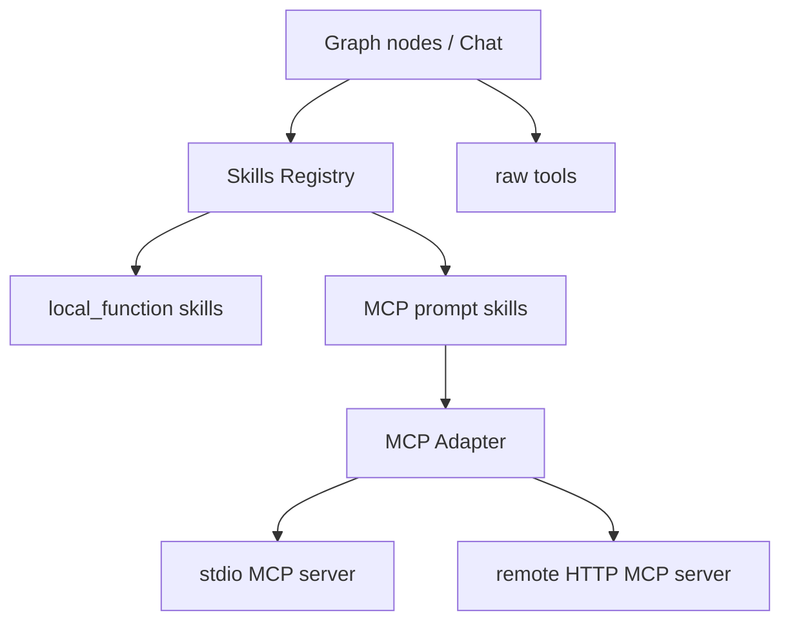

# PaperReader Agent — 工具、Skills 与 MCP

## 1. 当前能力层怎么分

这个项目不是把所有能力都直接塞进节点函数，而是拆成三层：

1. tools：底层调用能力
2. skills：结构化可复用能力单元
3. MCP：外部 prompt/tool/resource server 接入层

## 2. 能力结构图



## 3. 用了什么方法（Use What）

### 3.1 底层工具

- search tools
- arXiv API
- DeepXiv client
- PDF 处理
- MCP transport / invoke

### 3.2 Skills Registry

- skill manifest 注册
- backend 分类
- built-in + filesystem discovery
- local function / MCP prompt 等多 backend 统一执行

### 3.3 Skill Orchestrator

- 显式 `/skill_id ...`
- 隐式 LLM 决策 skill chain

### 3.4 MCP Adapter

- stdio transport
- remote HTTP transport
- tool / prompt / resource catalog

## 4. 当前项目怎么做（How To Do）

### 4.1 Skills API

```python
router = APIRouter(prefix="/api/v1/skills", tags=["skills"])

@router.get("", response_model=ListSkillsResponse)
async def list_skills() -> ListSkillsResponse:
    registry = _registry()
    return ListSkillsResponse(items=registry.list_meta())

@router.post("/run", response_model=SkillRunResponse)
async def run_skill(req: SkillRunRequest) -> SkillRunResponse:
    registry = _registry()
    resp = await registry.run(req, {"workspace_id": req.workspace_id})
    return resp
```

代码位置：`src/api/routes/skills.py`

### 4.2 Skills Registry 的初始化

```python
def get_skills_registry() -> SkillsRegistry:
    global _skills_registry
    if _skills_registry is None:
        _skills_registry = SkillsRegistry()
        _register_builtin_skills(_skills_registry)
        import os as _os
        base = _os.environ.get("SKILLS_SCAN_BASE", ".")
        _skills_registry.discover_from_filesystem(base)
        _register_research_skills_handlers(_skills_registry)
    return _skills_registry
```

代码位置：`src/skills/registry.py`

这说明当前 skill 来源有两类：

- 内置注册
- 文件系统发现

### 4.3 当前内置科研 skills

```python
registry.register(SkillManifest(
    skill_id="lit_review_scanner",
    name="Literature Review Scanner",
    description="Multi-source academic literature scan and candidate ranking.",
    backend=SkillBackend.LOCAL_FUNCTION,
    visibility=SkillVisibility.BOTH,
    default_agent=AgentRole.RETRIEVER,
    output_artifact_type="rag_result",
))

registry.register(SkillManifest(
    skill_id="claim_verification",
    name="Claim Verification",
    description="Verify scientific claims against retrieved evidence.",
    backend=SkillBackend.LOCAL_FUNCTION,
    visibility=SkillVisibility.BOTH,
    default_agent=AgentRole.REVIEWER,
    output_artifact_type="verified_report",
))
```

代码位置：`src/skills/registry.py`

### 4.4 draft 阶段如何消费 skills

```python
comparison_result = _run(
    "comparison_matrix_builder",
    {
        "paper_cards": cards,
        "compare_dimensions": ["methods", "datasets", "benchmarks", "limitations"],
        "format": "table",
    },
)

scaffold_result = _run(
    "writing_scaffold_generator",
    {
        "topic": topic,
        "paper_cards": cards,
        "comparison_matrix": bundle.get("comparison_matrix") or {},
        "desired_length": "long",
    },
)
```

代码位置：`src/research/graph/nodes/draft.py`

### 4.5 review 阶段如何消费 skill

```python
req = SkillRunRequest(
    workspace_id=workspace_id,
    task_id=task_id,
    skill_id="claim_verification",
    inputs={"draft_report": _serialize_report_payload(draft_report)},
    preferred_agent=AgentRole.REVIEWER,
)
resp = registry.run_sync(req, {"workspace_id": workspace_id, "task_id": task_id})
```

代码位置：`src/research/graph/nodes/review.py`

### 4.6 Skill Orchestrator

```python
if msg.startswith("/"):
    parts = msg[1:].split(None, 1)
    skill_id = parts[0]
    skill_args_raw = parts[1] if len(parts) > 1 else ""
    skill_args = self._parse_skill_args(skill_args_raw)
    result = await self._invoke_skill(skill_id, skill_args, ctx)
```

```python
decision = await self._llm_decide_tools(msg, tool_summaries, ctx)

if not decision.get("should_use_skills"):
    return {
        "mode": "chat",
        "skill_id": None,
        "response": None,
    }
```

代码位置：`src/skills/orchestrator.py`

这说明它已经支持：

- 显式技能调用
- 隐式技能链决策

但它还没有完全接进 `/tasks/{id}/chat` 主用户路径。

## 5. MCP 是怎么接的

### 5.1 MCP API

```python
router = APIRouter(prefix="/api/v1/mcp", tags=["mcp"])

@router.post("/servers/{server_id}/start")
async def start_mcp_server(server_id: str) -> dict:
    adapter = _adapter()
    await adapter.start_server(server_id)
    return {"status": "started", "server_id": server_id}

@router.post("/invoke", response_model=MCPInvocationResponse)
async def invoke_mcp(req: MCPInvocationRequest) -> MCPInvocationResponse:
    adapter = _adapter()
    return await adapter.invoke(req)
```

代码位置：`src/api/routes/mcp.py`

### 5.2 MCP transport 抽象

```python
class MCPTransport(ABC):
    @abstractmethod
    async def start(self) -> None:
        raise NotImplementedError

    @abstractmethod
    async def send(self, method: str, params: dict | None = None) -> dict:
        raise NotImplementedError
```

```python
class StdioTransport(MCPTransport):
    async def start(self) -> None:
        command = self.config.command or ""
        args = list(self.config.args) if self.config.args else []
        self._proc = subprocess.Popen(
            [command, *args],
            stdin=subprocess.PIPE,
            stdout=subprocess.PIPE,
            stderr=subprocess.PIPE,
            env={**subprocess.os.environ, **env},
            text=False,
        )
```

代码位置：`src/tools/mcp_adapter.py`

### 5.3 MCP server instance 如何发现能力

```python
resp = await self._transport.send("tools/list")
self._tools = [
    MCPToolDescriptor(
        server_id=self.server_id,
        tool_name=t.get("name", ""),
        title=t.get("title", t.get("name", "")),
        description=t.get("description", ""),
        input_schema=t.get("inputSchema", {}),
        tags=t.get("tags", []),
    )
    for t in resp.get("result", {}).get("tools", [])
]
```

代码位置：`src/tools/mcp_adapter.py`

## 6. 当前这套能力层的真实状态

### 已经接到主链路的

- `comparison_matrix_builder`
- `writing_scaffold_generator`
- `academic_review_writer_prompt`
- `claim_verification`

### 已经具备但还没完全产品化的

- `SkillOrchestrator`
- 隐式 skill chain 决策
- post-report 用户主动 skill 交互

### 需要诚实承认的边界

- 现在 draft/review 自动调用 skills 已经成立
- 但“报告生成后聊天框主动选择或自动链式调 skill”还不是主路径

## 7. 面试里怎么讲

推荐口径：

1. 底层是 tools，中层是 skills，上层是 MCP。
2. draft 和 review 已经在自动消费 skills。
3. registry 同时支持 built-in 和 filesystem discovery。
4. MCP 目前支持 stdio 和 remote HTTP transport。
5. SkillOrchestrator 已经存在，但 chat 主路径对主动 skills 的产品接入还要继续补。
