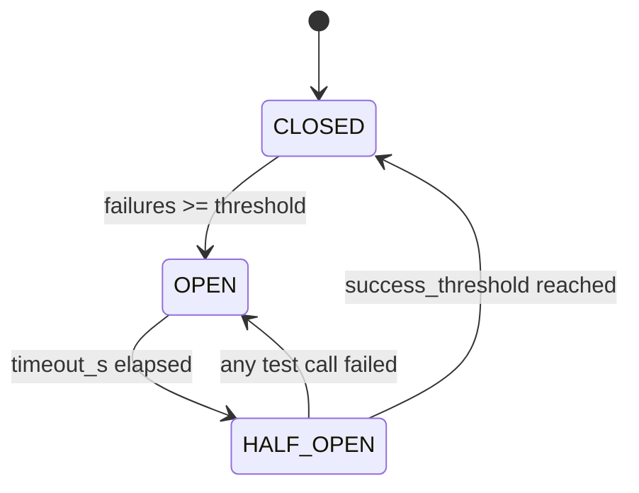

# PaperReader Agent — Circuit Breaker 熔断器设计

## 1. 这个模块在项目里的角色

Agent 系统要调用很多外部依赖：

- LLM
- SearXNG
- arXiv
- HTTP 下载

如果这些依赖连续失败，系统最怕出现的是：

- 一直重试
- 长时间卡死
- 空结果继续往后传
- 级联故障把整条 workflow 拖垮

因此当前仓库实现了一个真实的 `CircuitBreaker` 模块。

## 2. 状态机图



## 3. 用了什么方法（Use What）

### 3.1 标准熔断状态机

- CLOSED
- OPEN
- HALF_OPEN

### 3.2 并发安全

- `threading.Lock`

### 3.3 全局 breaker registry

- 不同 provider / model / endpoint 共享统一注册表

### 3.4 fallback 降级

- 熔断打开时可返回 fallback
- 调用异常时也可走 fallback

## 4. 当前项目怎么做（How To Do）

### 4.1 CircuitBreaker 配置

```python
@dataclass
class CircuitBreakerConfig:
    failure_threshold: int = 5
    timeout_s: float = 60.0
    half_open_max_calls: int = 1
    success_threshold: int = 1
```

代码位置：`src/agent/circuit_breaker.py`

### 4.2 状态切换

```python
@property
def state(self) -> CircuitState:
    with self._lock:
        if self._state == CircuitState.OPEN:
            if self._last_failure_time is not None:
                elapsed = time.monotonic() - self._last_failure_time
                if elapsed >= self.config.timeout_s:
                    self._state = CircuitState.HALF_OPEN
                    self._half_open_calls = 0
                    self._success_count = 0
        return self._state
```

代码位置：`src/agent/circuit_breaker.py`

### 4.3 成功 / 失败如何记录

```python
def record_success(self) -> None:
    with self._lock:
        if self._state == CircuitState.HALF_OPEN:
            self._success_count += 1
            if self._success_count >= self.config.success_threshold:
                self._state = CircuitState.CLOSED
                self._failure_count = 0
                self._success_count = 0
                self._half_open_calls = 0
```

```python
def record_failure(self) -> None:
    with self._lock:
        self._failure_count += 1
        self._last_failure_time = time.monotonic()
        if self._state == CircuitState.HALF_OPEN:
            self._state = CircuitState.OPEN
        elif self._state == CircuitState.CLOSED:
            if self._failure_count >= self.config.failure_threshold:
                self._state = CircuitState.OPEN
```

代码位置：`src/agent/circuit_breaker.py`

### 4.4 统一执行入口

```python
def execute(
    self,
    func: Callable[..., T],
    fallback: Callable[[], T] | T | None = None,
    *args,
    **kwargs,
) -> T:
    if not self.can_execute():
        if fallback is not None:
            if callable(fallback):
                return fallback()
            return fallback
        raise CircuitOpenError(f"Circuit breaker '{self.key}' is OPEN")

    try:
        result = func(*args, **kwargs)
        self.record_success()
        return result
    except Exception:
        self.record_failure()
```

代码位置：`src/agent/circuit_breaker.py`

### 4.5 默认 breaker 配置

```python
_DEFAULT_CONFIGS: dict[str, CircuitBreakerConfig] = {
    "deepseek/deepseek-chat": CircuitBreakerConfig(failure_threshold=5, timeout_s=60.0),
    "deepseek/deepseek-reasoner": CircuitBreakerConfig(failure_threshold=3, timeout_s=30.0),
    "openai/gpt-5.4": CircuitBreakerConfig(failure_threshold=5, timeout_s=60.0),
    "searxng": CircuitBreakerConfig(failure_threshold=3, timeout_s=60.0),
    "arxiv": CircuitBreakerConfig(failure_threshold=5, timeout_s=120.0),
    "arxiv/direct": CircuitBreakerConfig(failure_threshold=5, timeout_s=180.0),
    "http/download": CircuitBreakerConfig(failure_threshold=3, timeout_s=30.0),
}
```

代码位置：`src/agent/circuit_breaker.py`

## 5. 这个模块现在能回答什么工程问题

### 5.1 为什么不会一直重试挂死

- breaker 打开后直接拒绝
- 或使用 fallback

### 5.2 为什么不同依赖可以有不同阈值

- 默认配置按 provider/model/endpoint 区分

### 5.3 为什么可以做人工干预和监控

仓库还提供 breaker 状态查询和 reset API。

```python
@router.get("/circuit-breakers", response_model=CircuitBreakerListResponse)
async def get_circuit_breaker_status() -> CircuitBreakerListResponse:
    ...

@router.post("/circuit-breakers/reset", response_model=CircuitBreakerResetResponse)
async def reset_circuit_breaker(req: CircuitBreakerResetRequest) -> CircuitBreakerResetResponse:
    ...
```

代码位置：`src/api/routes/agents.py`

## 6. 当前边界

- 这是单进程内 breaker registry，不是分布式共享 breaker。
- 它更适合当前单服务进程场景。
- 对跨实例共享故障状态，目前没有统一集中式实现。

## 7. 面试里怎么讲

推荐口径：

1. 我们对 LLM、搜索和下载依赖加了标准 Circuit Breaker。
2. 不是简单 try/except，而是有 CLOSED/OPEN/HALF_OPEN 状态机。
3. breaker 支持 fallback，也有 registry 和管理 API。
4. 当前是进程内实现，适合当前单服务部署形态。
