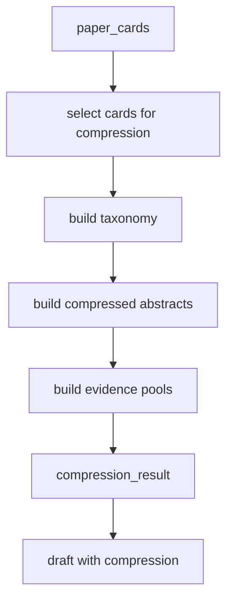

# PaperReader Agent — Context Compression 上下文压缩设计

## 1. 为什么这个模块重要

survey 模式一旦找到十几篇到几十篇论文，原始 `paper_cards` 很容易超出写作阶段的可控上下文。当前项目没有继续走“固定取前 N 篇卡片”的老路，而是在 `extract` 和 `draft` 之间插入了一个独立压缩节点。

## 2. 压缩工作流图



## 3. 用了什么方法（Use What）

### 3.1 预算式卡片选择

- `MAX_COMPRESSION_CARDS`
- `COMPRESSION_CHAR_BUDGET`
- fulltext 优先
- bucket 轮转保多样性

### 3.2 三段式压缩

- taxonomy
- compressed cards
- section evidence pools

### 3.3 section token budgets

- introduction
- methods
- evaluation
- discussion 等章节分别配置预算

## 4. 当前项目怎么做（How To Do）

### 4.1 压缩节点只是 workflow 上的一步

```python
@trace_node(node_name="extract_compression", stage="compress", store=get_trace_store())
def extract_compression_node(state: dict) -> dict:
    paper_cards = state.get("paper_cards", [])
    brief = state.get("brief")

    if not paper_cards:
        logger.warning("[extract_compression_node] no paper_cards, skipping")
        return {"compression_result": None}

    result = compress_paper_cards(paper_cards, brief)
    return {
        "compression_result": result.model_dump(),
        "taxonomy": result.taxonomy.model_dump(),
    }
```

代码位置：`src/research/graph/nodes/extract_compression.py`

### 4.2 压缩服务的主入口

```python
def compress_paper_cards(
    paper_cards: list[dict[str, Any]],
    brief: ResearchBrief | dict[str, Any] | None,
) -> CompressionResult:
    if not paper_cards:
        return CompressionResult()

    cards_to_process = _select_cards_for_compression(
        paper_cards,
        max_cards=MAX_COMPRESSION_CARDS,
        char_budget=COMPRESSION_CHAR_BUDGET,
    )

    taxonomy = _build_taxonomy(cards_to_process, brief)
    compressed = _build_compressed_abstracts(cards_to_process, taxonomy)
    pools = _build_evidence_pools(compressed, taxonomy, brief)
```

代码位置：`src/research/services/compression.py`

### 4.3 预算式选择，不固定前 N

```python
MAX_COMPRESSION_CARDS = 28
COMPRESSION_CHAR_BUDGET = 42000

def _select_cards_for_compression(
    paper_cards: list[dict[str, Any]],
    *,
    max_cards: int,
    char_budget: int,
) -> list[dict[str, Any]]:
    if len(paper_cards) <= max_cards:
        return list(paper_cards)
```

```python
for card in sorted(
    paper_cards,
    key=lambda item: (
        1 if item.get("fulltext_available") else 0,
        float(item.get("combined_score") or item.get("score") or 0.0),
        len(str(item.get("summary") or item.get("abstract") or "")),
    ),
    reverse=True,
):
    bucket = _compression_bucket(card)
    buckets.setdefault(bucket, []).append(card)
```

代码位置：`src/research/services/compression.py`

这段设计的重点是：

- 先保全文证据
- 再保分数
- 最后按主题 bucket 保多样性

### 4.4 taxonomy 如何生成

```python
SYSTEM = (
    "You are a paper taxonomy expert. Given a list of research papers, "
    "organize them into a hierarchical taxonomy based on technical approaches, "
    "sub-domains, or research paradigms. "
    "The output MUST be strictly valid JSON (no markdown code blocks)."
)

response = llm.invoke([SystemMessage(content=SYSTEM), HumanMessage(content=USER)])
```

代码位置：`src/research/services/compression.py`

### 4.5 压缩卡片如何生成

```python
SYSTEM = (
    "You are a research paper summarizer. Compress each paper abstract to its core claim. "
    "The output MUST be strictly valid JSON array (no markdown code blocks)."
)

return [
    CompressedCard(
        title=c.get("title", ""),
        arxiv_id=c.get("arxiv_id", ""),
        core_claim=c.get("core_claim", ""),
        method_type=c.get("method_type", ""),
        key_result=c.get("key_result", ""),
        role_in_taxonomy=c.get("role_in_taxonomy", ""),
        connections=c.get("connections", []),
    )
    for c in data
]
```

代码位置：`src/research/services/compression.py`

### 4.6 section evidence pools 如何分配

```python
SECTION_TOKEN_BUDGETS = {
    "introduction": 8000,
    "background": 6000,
    "taxonomy": 8000,
    "methods": 10000,
    "datasets": 4000,
    "evaluation": 6000,
    "discussion": 5000,
    "future_work": 4000,
    "conclusion": 2000,
}
```

```python
for section in sections:
    pools[section] = EvidencePool(
        section=section,
        token_budget=SECTION_TOKEN_BUDGETS.get(section, 5000),
        papers=[],
    )
```

代码位置：`src/research/services/compression.py`

## 5. draft 阶段是如何消费压缩结果的

```python
compression_result = state.get("compression_result")

if compression_result:
    draft_report = _build_draft_with_compression(
        paper_cards, brief, compression_result, skill_artifacts=skill_artifacts
    )
else:
    draft_report = _build_draft_report(paper_cards, brief, skill_artifacts=skill_artifacts)
```

代码位置：`src/research/graph/nodes/draft.py`

这说明压缩不是“离线分析报告”，而是直接参与最终成文。

## 6. 这个模块解决了什么问题

### 6.1 防止超长上下文直接塞给 draft

- 不再盲目把所有 raw cards 原样塞进 prompt

### 6.2 防止只看前几篇论文

- 改成 budget + diversity 选择

### 6.3 让写作从结构化证据出发

- taxonomy 给分类框架
- compressed cards 给核心 claim
- evidence pools 给 section 级支撑

## 7. 面试里怎么讲

推荐口径：

1. 我们把 compression 做成了独立 graph node。
2. 核心不是摘要压缩本身，而是把 raw paper cards 变成 taxonomy、compressed cards 和 section evidence pools。
3. draft 阶段真正消费的是这些结构化压缩结果，所以它是写作质量改进模块，不是装饰性中间件。
