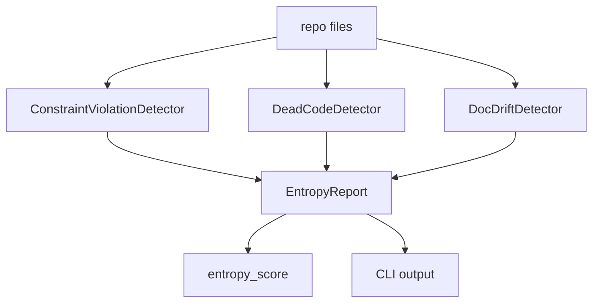

# PaperReader Agent — Entropy Management 熵管理系统设计

## 1. 这个模块的定位

`src/entropy/` 不是运行时生成主链的一部分，而是一个代码库治理与漂移检测模块。它服务的问题不是“怎么写报告”，而是“项目演进后代码和文档是否开始腐化”。

## 2. 熵管理流程图



## 3. 用了什么方法（Use What）

### 3.1 统一报告模型

- `DriftReport`
- `EntropySummary`
- `EntropyReport`

### 3.2 detector 分层

- 约束违反检测
- 死代码 / 孤立文件检测
- 文档漂移检测

### 3.3 CLI 驱动

- `python -m src.entropy.cli scan`
- `python -m src.entropy.cli check`

## 4. 当前项目怎么做（How To Do）

### 4.1 核心数据结构

```python
class DriftType(str, Enum):
    MISSING_DOC = "missing_doc"
    UNENFORCED_CONSTRAINT = "unenforced_constraint"
    MISSING_NODE_FILE = "missing_node_file"
    ORPHANED_FILE = "orphaned_file"
    STYLE_DRIFT = "style_drift"
    ARTIFACT_QUALITY = "artifact_quality"
```

```python
@dataclass
class EntropyReport:
    timestamp: str = ""
    trigger: str = "manual"
    summary: EntropySummary = field(default_factory=EntropySummary)
    drift_reports: list[DriftReport] = field(default_factory=list)
    auto_fix_changes: list[dict] = field(default_factory=list)
    pending_changes: list[dict] = field(default_factory=list)
    entropy_score: float = 100.0
```

代码位置：`src/entropy/scanner.py`

### 4.2 熵分数如何更新

```python
def add_drift(self, drift: DriftReport) -> None:
    self.drift_reports.append(drift)
    self.summary.total_issues += 1
    if drift.severity == Severity.CRITICAL:
        self.summary.critical += 1
    elif drift.severity == Severity.WARNING:
        self.summary.warning += 1
    else:
        self.summary.info += 1

    if drift.severity == Severity.CRITICAL:
        self.entropy_score -= 10
    elif drift.severity == Severity.WARNING:
        self.entropy_score -= 3
    else:
        self.entropy_score -= 1
```

代码位置：`src/entropy/scanner.py`

### 4.3 约束违反检测

```python
HARD_CONSTRAINTS: list[dict[str, Any]] = [
    {
        "id": "no_sqlite",
        "description": "禁止引入 SQLite 数据库或 sqlite:/// URL",
        "check_patterns": [r"sqlite:///"],
        "file_patterns": ["*.py", "*.yaml", "*.yml", "*.json"],
        "severity": Severity.CRITICAL,
    },
    {
        "id": "explicit_dotenv",
        "description": "脚本和测试必须显式 load_dotenv('.env')",
        "check_patterns": [r"open.*\.env", r"load_dotenv.*\.env"],
        "file_patterns": ["tests/**/*.py"],
        "severity": Severity.WARNING,
    },
]
```

代码位置：`src/entropy/detectors/constraint.py`

这和仓库硬规则是呼应的：

- 禁 SQLite
- 测试与脚本显式加载 `.env`

### 4.4 死代码 / 孤立文件检测

```python
supervisor_path = root / "src/research/agents/supervisor.py"
if supervisor_path.exists():
    reports.extend(self._check_supervisor_node_refs(supervisor_path))

reports.extend(self._check_orphaned_files(root))
```

```python
if module_name not in all_imports and not self._has_any_reference(py_file):
    if "test_" not in py_file.name and py_file.name != "__init__.py":
        reports.append(
            DriftReport(
                drift_type=DriftType.ORPHANED_FILE,
                source_file=str(py_file.relative_to(root)),
                expected_state="文件被其他代码引用",
                actual_state="文件未被任何地方引用",
                severity=Severity.INFO,
            )
        )
```

代码位置：`src/entropy/detectors/constraint.py`

### 4.5 CLI 输出

CLI 层已经接好，可直接执行扫描。

```python
"""
Usage:
    python -m src.entropy.cli scan
    python -m src.entropy.cli scan --files src/research/agents/supervisor.py
    python -m src.entropy.cli scan --format json
"""
```

代码位置：`src/entropy/cli.py`

## 5. 这个模块对当前项目的价值

### 5.1 防止文档和代码长期漂移

- 这类 AI Agent 项目变化快
- 一旦没人主动对齐，文档会先坏掉

### 5.2 防止迁移期残留越来越多

- supervisor / agents / workflow 演进期间，很容易出现孤立路径

### 5.3 把“代码库腐化”变成可扫描问题

- 不再完全依赖人工记忆

## 6. 当前边界

- 这套模块更多是 repo hygiene / engineering governance，不是运行时在线服务。
- 它现在的 detector 仍偏规则化，不是完整语义级静态分析器。
- 但对当前仓库这种快速迭代项目已经足够有价值。

## 7. 面试里怎么讲

推荐口径：

1. 我们除了主链，还做了一个 repo-level entropy management 模块。
2. 它负责检测约束违反、死代码和文档漂移。
3. 核心产出是 `EntropyReport` 和 `entropy_score`，并通过 CLI 暴露。
4. 这体现的是工程治理能力，而不是业务主链能力。
